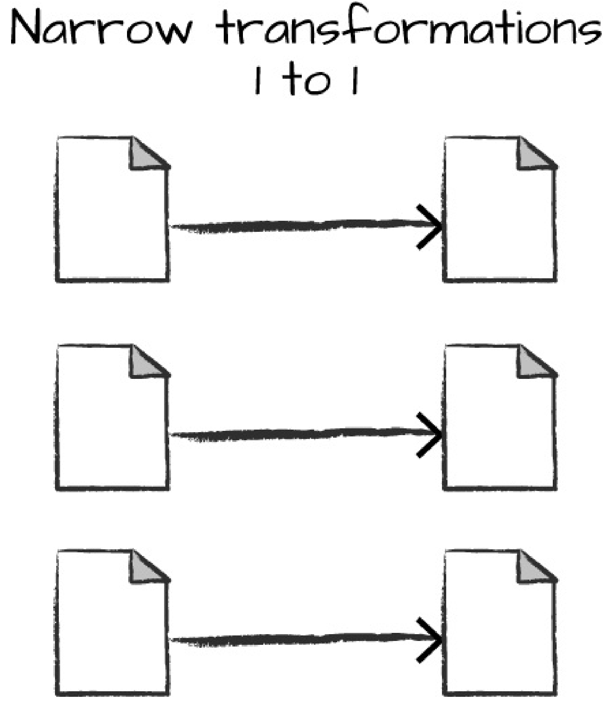
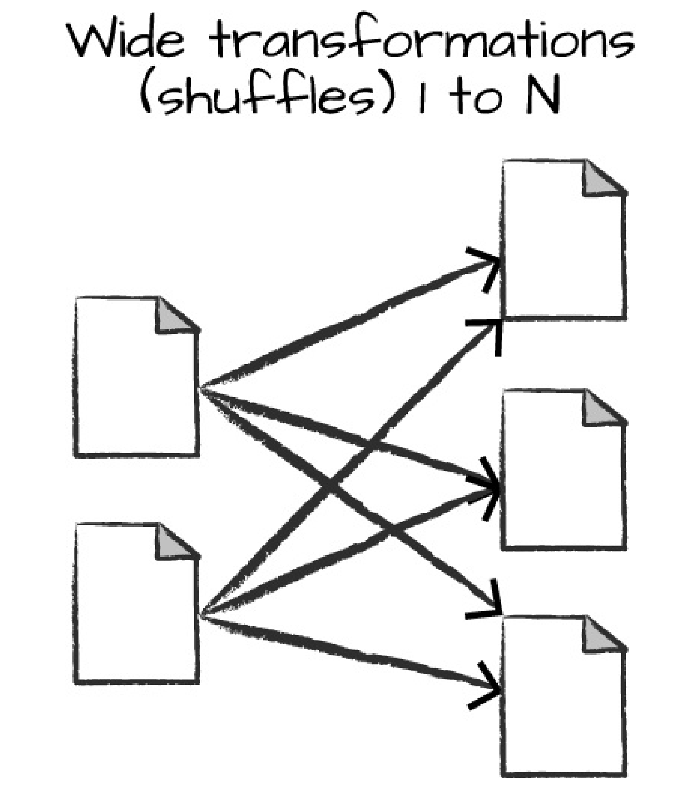
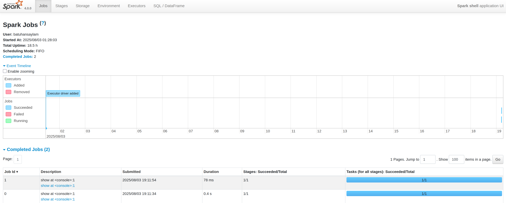

# Install Scala on your computer

Firstly, The scala language is installed on the computer via following bash code block.</br>

```bash
curl -fL https://github.com/coursier/coursier/releases/latest/download/cs-x86_64-pc-linux.gz | gzip -d > cs && chmod +x cs && ./cs setup
```

After the installing, the computer is rebooted.</br>

Then check the scala.</br>

```bash
scala -version
```

Output:</br>
```bash
Scala code runner version: 1.8.4
Scala version (default): 3.7.2

```

After all, the scala and the compiler of scala can be launched via </br>

```bash
cs launch scala:3.7.2

cs launch scalac:3.7.2

```

# [Print "Hello World"](./hello.scala)

Firstly, the "Hello world" is printed on the screen.</br>
```bash
scala run hello.scala
```
Output:</br>
```bash
Starting compilation server
Compiling project (Scala 3.7.2, JVM (21))
Compiled project (Scala 3.7.2, JVM (21))
Hello, World!
```

# Download Spark 

First, the [location](https://dlcdn.apache.org/spark/spark-4.0.0/spark-4.0.0-bin-hadoop3.tgz) has to be installed on the computer via the following code block.</br>
```bash
wget https://dlcdn.apache.org/spark/spark-4.0.0/spark-4.0.0-bin-hadoop3.tgz

tar -xf spark-4.0.0-bin-hadoop3.tgz
```
and go to the folder.</br>
```bash
cd spark-4.0.0-bin-hadoop3
```
 # The SparkSession

After that, via the following code block activate scala.</br>

```bash
./bin/spark-shell
```
Via the following code block activate pyspark.</br>

```bash
./bin/pyspark
```
You control your Spark Application through a
driver process called the SparkSession. The SparkSession instance is the way Spark executes
user-defined manipulations across the cluster. There is a one-to-one correspondence between a
SparkSession and a Spark Application. In Scala and Python, the variable is available as spark
when you start the console. Let’s go ahead and look at the SparkSession in both Scala and/or
Python.[1]</p>

For scala, the SparkSession can be thought as REPL.</br>
For scala:
```bash
scala> spark
```

Output:
```bash
val res1: org.apache.spark.sql.SparkSession = org.apache.spark.sql.classic.SparkSession@68886059
```

For python:

```bash
spark
```

Output:
```bash
<pyspark.sql.session.SparkSession object at 0x7f3a969ac4a0>
```

# Dataframes

The dataframes can be thought as a spreadsheet with named columns; however the spark dataframe can span thousands of computers whereas a spreedsheet sits on one computer in one specific location. </br>

You can name the results of expressions using the **val** keyword. Named results, such as df here, are called values. Referencing a value does not re-compute it whereas **var** can be re-assigned.[2]</br>
```scala
val df = spark.range(1000).toDF("number")
```
Despite the scala, on python scripts, **''** can be used instead of **""**.</br>
```python
df = spark.range(1000).toDF("number")
```
# Partitions

To allow every executor to perform work in parallel, Spark breaks up the data into chunks called
partitions. A partition is a collection of rows that sit on one physical machine in your cluster. A
DataFrame’s partitions represent how the data is physically distributed across the cluster of
machines during execution. If you have one partition, Spark will have a parallelism of only one,
even if you have thousands of executors. If you have many partitions but only one executor,
Spark will still have a parallelism of only one because there is only one computation resource.[1]</p>

# Transformations
In Spark, the core data structures are immutable, meaning they cannot be changed after they’re
created. This might seem like a strange concept at first: if you cannot change it, how are you
supposed to use it? To “change” a DataFrame, you need to instruct Spark how you would like to
modify it to do what you want. These instructions are called transformations.</p>
Scala:
```scala
val  divisby2 = df.where("number % 2 = 0")
divisby2.show()
```
Python:
```python
divisby2 = df.where("number % 2 = 0")
divisby2.show()
```
Take note that these first lines don't produce anything.  This is due to the fact that we merely specified an abstract transformation, and Spark won't do anything with it until we call an action (like show()), which we will cover in a moment.</p>
 The foundation of utilizing Spark to express your business logic is transformations.  Transformations can be divided into two categories: those that define narrow dependencies and those that define wide dependencies. </p>

 ## Narrow Transformations
Each input partition will contribute to only one output partition.</br>

## Wide Transformations
A wide dependency (or wide transformation) style transformation will have input partitions
contributing to many output partitions. You will often hear this referred to as a shuffle whereby
Spark will exchange partitions across the cluster.</p>


With narrow transformations, Spark will
automatically perform an operation called pipelining, meaning that if we specify multiple filters
on DataFrames, they’ll all be performed in-memory. The same cannot be said for shuffles. When
we perform a shuffle, Spark writes the results to disk.[1] </p>


Since shuffle optimization is a significant topic, you'll see a lot of discussion about it online. For the time being, though, you just need to know that there are two types of transformations.  As you can see now, transformations are just methods of defining various data manipulation sequences.  This brings up the subject of lazy evaluation.</p>


## Lazy Evaluation

-Lazy evaluation is a fundamental and powerful concept in Apache Spark. It's one of the main reasons Spark achieves high performance and efficiency. This means Spark doesn't execute a transformation immediately. Instead, it creates a logical execution plan, or Directed Acyclic Graph (DAG), that represents the sequence of transformations you define.

### How It Works: Transformations and Actions

The essence of lazy evaluation in Spark is based on the difference between transformations and actions.

- **Transformations**: These are operations that create a new DataFrame from an existing DataFrame (or RDD/Dataset). Examples include filter(), select(), groupBy(), withColumn(), and join(). When you call a transformation, Spark simply records it in the execution plan. No data is processed or moved at this point.

- **Actions**: These are operations that trigger the execution of the entire transformation chain. Actions cause Spark to actually perform computations and return a result. Examples include show(), count(), collect(), saveAsTextFile(), and take(). When an action is called, Spark examines the entire transformation DAG, optimizes it, and then executes the necessary tasks on the cluster.

### Benefits of Lazy Evaluation

By not executing transformations immediately, Spark gains several key advantages:

- **Optimization**: Spark's Catalyst Optimizer and Tungsten Execution Engine can analyze the entire transformation chain and find the most efficient way to execute them. For example, if you filter data and then select several columns, Spark can apply the filtering and column selection operations in a single pass over the data to avoid redundant computations. This is called operator fusion.

- **Resource Efficiency**: Because intermediate results are not persisted to memory or disk until an action is called, Spark can save storage and memory resources. It only calculates what is absolutely necessary to produce the final result.

- **Error Tolerance**: Lazy evaluation makes it easier for Spark to recover from errors. Because Spark maintains a lineage graph of all transformations, it can recalculate portions of the RDD or DataFrame that are lost by rerunning the necessary steps from a reliable data source.

- **Short-Circuiting**: Spark can "short-circuit" computations. For example, if you have a very large dataset and only want to see the first 10 rows with take(10), Spark will process only the portions necessary to retrieve those 10 rows, rather than processing the entire dataset.


# Spark UI


You can monitor the progress of a job through the Spark web UI. The Spark UI is available on
port 4040 of the driver node. If you are running in local mode, this will be http://localhost:4040.
The Spark UI displays information on the state of your Spark jobs, its environment, and cluster
state. It’s very useful, especially for tuning and debugging</p>




# Others

- [End to End Example](./end-to-end_example)


# References

[1] https://raw.githubusercontent.com/rameshvunna/PySpark/master/Spark-The%20Definitive%20Guide.pdf

[2] https://docs.scala-lang.org/tour/basics.html

